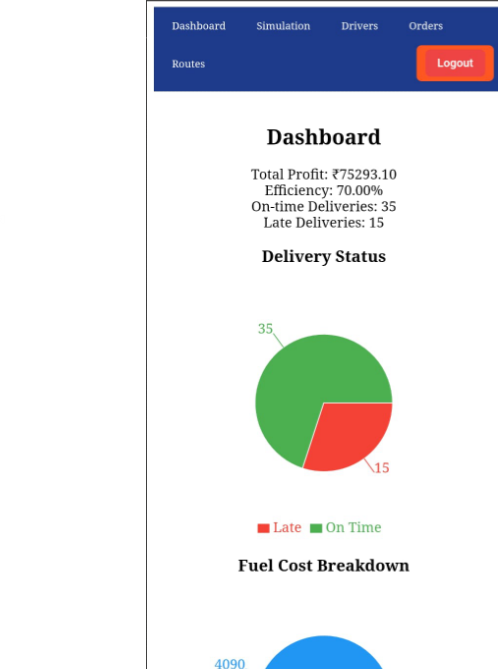

# 🚚 GreenCart Logistics Dashboard

A full-stack logistics management dashboard to monitor **drivers, routes, orders, fuel usage, and simulations**.  
Built with **React, Node.js, Express, and PostgreSQL**, deployed on **Vercel, Render, and Neon**.

---

## 🌟 Features

- 📊 **Dashboard Analytics** – Fuel usage, driver performance, and route monitoring with interactive charts.  
- 👩‍✈️ **Driver & Orders Management** – Add, edit, and track drivers and delivery orders.  
- 🛣 **Route Simulation** – Simulate delivery routes with shift hours and past week performance.  
- 🔑 **Authentication** – Secure login/logout using JWT tokens.  
- 🌐 **Cloud-Native Deployment** –  
  - Frontend hosted on **Vercel**  
  - Backend REST API hosted on **Render**  
  - PostgreSQL Database on **Neon**  

---

## 🖼 Screenshots

- Dashboard View  
- Orders Page  
- Fuel Analytics (Pie Chart)  
- Responsive Navbar (Mobile/Desktop)  

---

## 🛠 Tech Stack

**Frontend**  
- React (Vite/CRA)  
- Recharts (for charts/analytics)  
- Responsive CSS (Flex/Grid + Media Queries)  
- Vercel Deployment  

**Backend**  
- Node.js + Express  
- JWT Authentication  
- RESTful APIs for Drivers, Orders, Routes  
- Render Deployment  

**Database**  
- PostgreSQL (NeonDB - serverless cloud database)  
- Connection pooling for scalable queries  

---

## 🚀 Deployment Links

- **Frontend (Vercel):** [Live Demo](https://greencart-logistics-sneha-sharmas-projects-959f7276.vercel.app?_vercel_share=mQEN6hfdNjmXzoNMdVcn2S2pre5tz4wf)  
- **Backend (Render):** [API Docs](https://greencart-logistics-zul8.onrender.com)  
- **Database (Neon):** PostgreSQL cloud-hosted instance  

---
